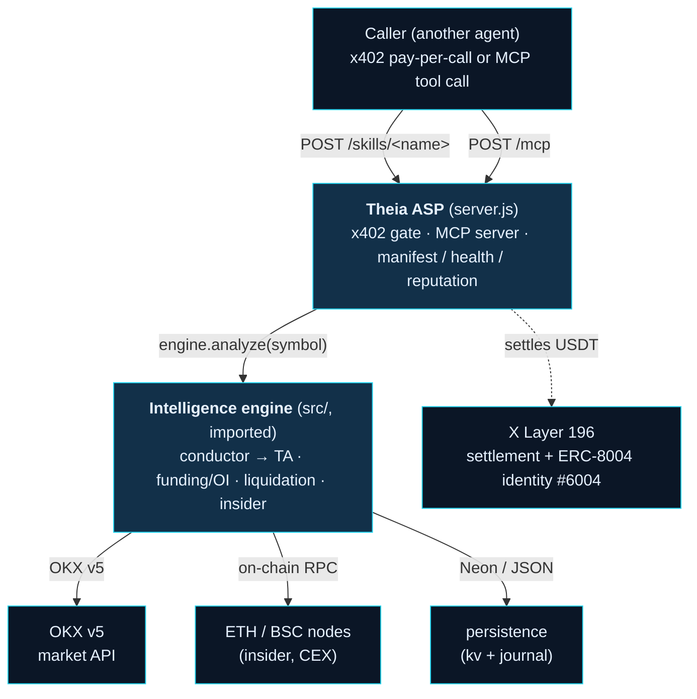
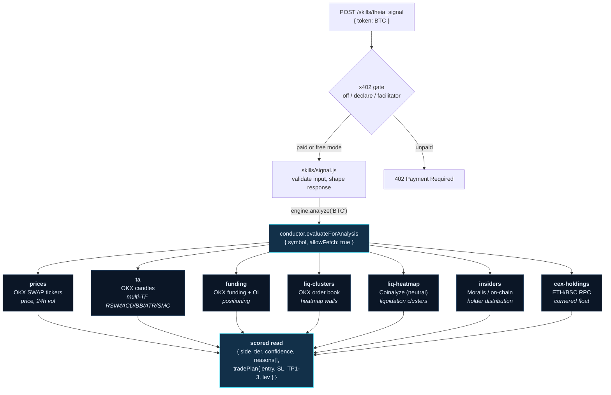
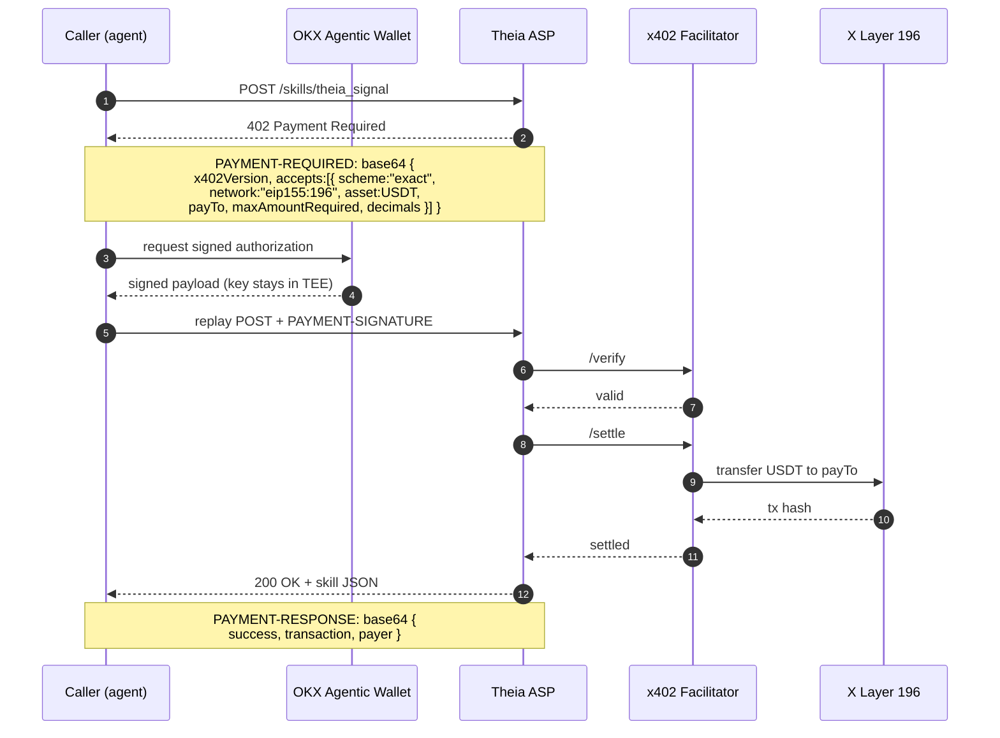
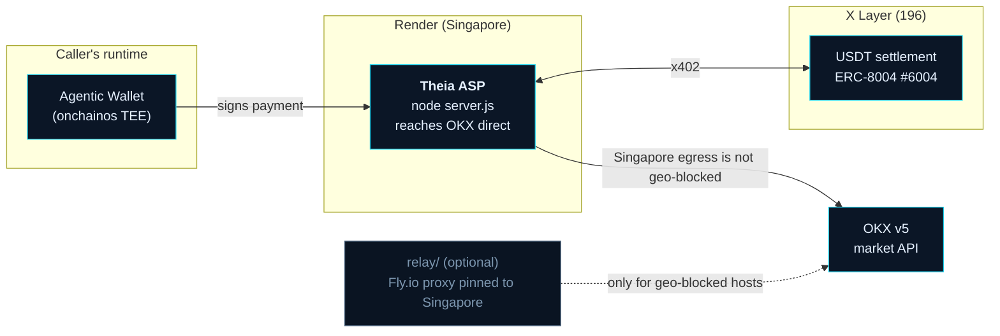

# Theia: Architecture

Theia is a deterministic crypto-intelligence engine exposed as an **Agent Service
Provider (ASP) on OKX.AI**. Other agents pay Theia to answer the questions that move
markets: is this token being manipulated, are insiders distributing, where is exchange
flow heading, where are the liquidation magnets, and what is the confluence-scored
trade plan.

It is **OKX-native end to end**: every market-data read comes from the OKX v5 API,
payments settle in USDT on **X Layer**, identity is an **ERC-8004** on-chain agent,
and the skills are exposed both as **x402 HTTP endpoints** and as **MCP tools**.

- Live agent: **`#6004`** on OKX.AI (X Layer 196)
- Endpoint: `https://theia-asp.onrender.com`

---

## 1. Design principles

- **Deterministic and auditable.** Scoring is pure, rule-based math. An LLM may
  narrate output, but never decides a trade. Every signal can be recomputed from its
  inputs.
- **Reuse, not rebuild.** A production intelligence engine (`src/`) is imported behind
  a thin ASP layer. The ASP never forks the scoring logic.
- **OKX-first.** All exchange data (prices, funding, open interest, candles, order
  book, taker volume) is sourced from OKX v5. No competitor-exchange dependency.
- **Graceful degradation.** A missing data source lowers one skill's fidelity; it
  never crashes the service.
- **Pay-per-value.** Cheap flat per-call pricing over x402 encourages volume; a
  premium escrow tier serves high-value multi-token audits.

## 2. System context

## 3. Components

| Component | Path | Responsibility |
|---|---|---|
| ASP host | `server.js` | Express host: x402-gated `POST /skills/<name>`, MCP `POST /mcp`, free `GET /` `/health` `/reputation` `POST /a2a/quote` |
| Engine boot | `engine.js` | Headless boot of the intelligence engine; wires only on-demand subsystems; degrades gracefully |
| Config | `config.js` | Environment: server, x402 (X Layer USDT), prices, data sources, reputation |
| Skill adapters | `skills/*.js` | Six thin, schema-validated adapters over the engine (one per A2MCP skill) |
| x402 middleware | `payments/x402.js` | Seller-side x402 V2: builds the 402 challenge, verifies + settles via a facilitator |
| A2A Deep Desk | `a2a/deep-desk.js` | Escrow audit: conviction filter, multi-skill run, structured report, CLI hooks |
| Reputation ledger | `reputation/ledger.js` | Hashes real resolved outcomes into a Merkle root anchored on X Layer |
| OKX client | `src/okx.js` | OKX v5 market data: candles, tickers, funding, OI, order book, taker volume, instruments |
| Confluence brain | `src/conductor.js` | Scores side, tier, confidence, reasons, and the trade plan |
| Multi-TF TA | `src/ta.js`, `src/smc.js`, `src/timeframes.js` | RSI/MACD/BB/ATR + market structure across timeframes |
| Insider / CEX edge | `src/team-wallet-discovery.js`, `src/cex-holdings.js` | Largest non-exchange holders; exchange cold-wallet concentration |
| Data relay | `relay/` | Optional Singapore reverse-proxy so geo-blocked hosts can reach OKX |

## 4. The six A2MCP skills

| Skill | Returns | Price |
|---|---|---|
| `theia_signal` | Confluence side, tier, confidence, scored reasons, full trade plan | 0.05 USDT |
| `theia_manipulation_check` | Pump-and-dump / wash-trade risk 0-100% with flags | 0.05 USDT |
| `theia_cex_flow` | Direction + materiality of supply into/out of exchange custody | 0.05 USDT |
| `theia_insider_scan` | Largest non-exchange insider holders + top-10 concentration | 0.05 USDT |
| `theia_liqmap` | Leverage-liquidation clusters above/below price | 0.05 USDT |
| `theia_cex_holdings` | Cornered float: cold-wallet concentration by token or exchange | 0.02 USDT |

Each returns clean structured JSON against a defined schema. The premium **A2A**
service, **Theia Deep Desk**, delivers a full multi-token audit as an escrow-backed
report, released on sign-off.

## 5. The signal path (data flow)

OKX is the exchange source throughout. Coinalyze and CoinGecko are neutral
aggregators (liquidations, TA cache, token universe); Moralis provides on-chain holder
discovery. All external fetches carry an `AbortSignal` timeout.

## 6. x402 payment flow

A2MCP is fully automatic pay-per-call using the x402 V2 standard on X Layer.

The seller middleware runs in three modes: `off` (free dev/demo), `declare` (returns
a valid 402 challenge, no settlement), and `facilitator` (full verify + settle). The
receiving wallet key lives in the `onchainos` TEE, never in application code.

## 7. Verifiable reputation

`signal-tracker` resolves every fired signal to a real outcome (TP/SL/expiry). The
reputation ledger canonicalises each resolved signal, hashes it, and builds an
order-independent **Merkle root** anchored on X Layer. The win-rate is therefore
auditable on-chain, not claimed. Only real resolved outcomes are published.

## 8. Deployment topology

The ASP is hosted in a region OKX allows (Singapore), so it reaches OKX directly with
no relay. For geo-blocked hosts, the optional `relay/` (a Fly.io reverse-proxy pinned
to Singapore) provides the same reachability.

## 9. Technology

- **Runtime:** Node.js (ESM), Express.
- **Protocols:** x402 V2 (payments), Model Context Protocol (tool exposure over
  Streamable HTTP), ERC-8004 (agent identity).
- **Chain:** X Layer (chainId 196) for settlement + identity; Ethereum / BSC RPC for
  on-chain holder analysis.
- **Data:** OKX v5 market API (exchange data); Coinalyze, CoinGecko, Moralis (neutral
  aggregators / on-chain).
- **Persistence:** Neon Postgres with a JSON fallback.
